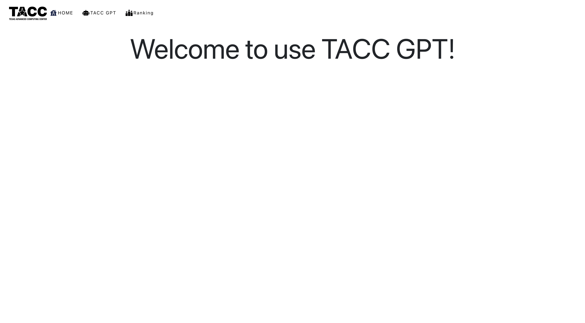
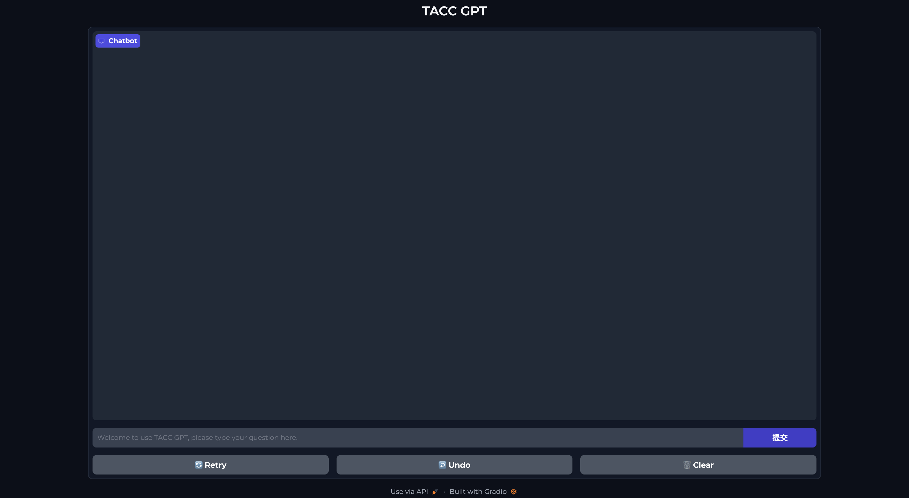
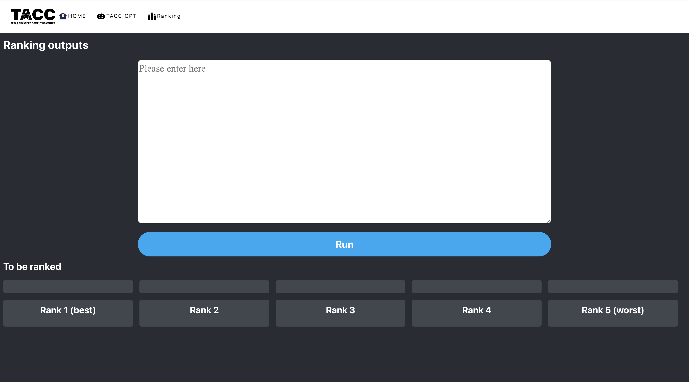
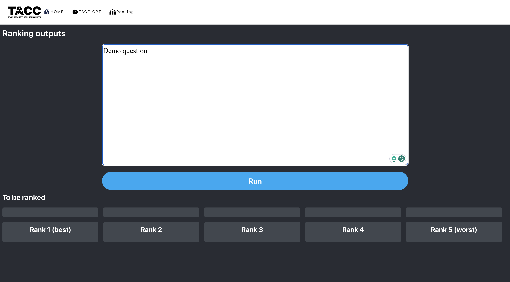
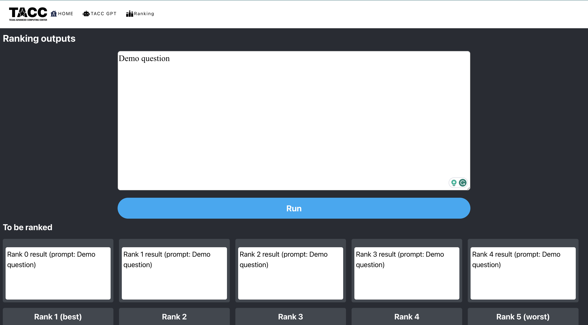
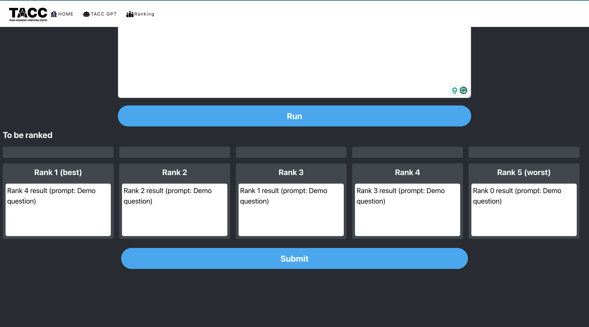
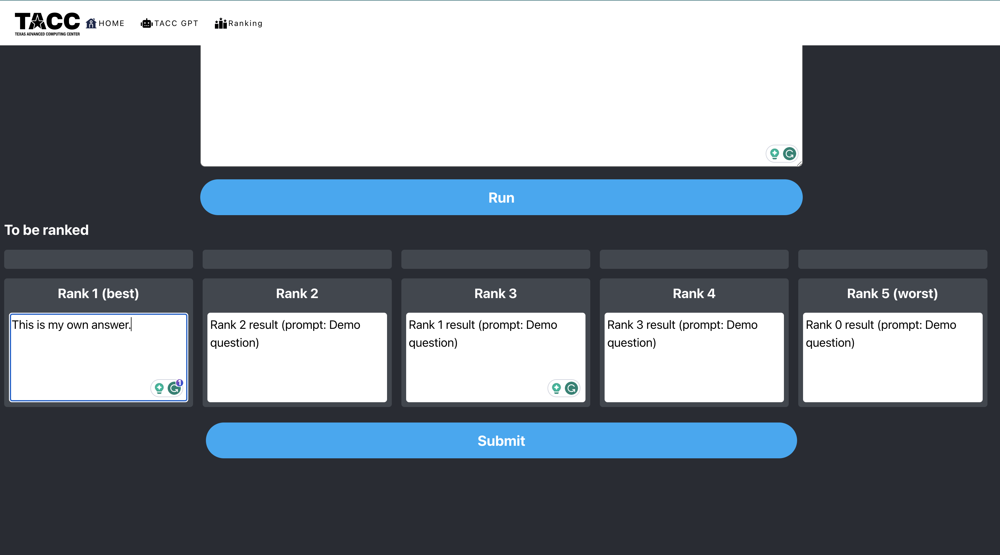
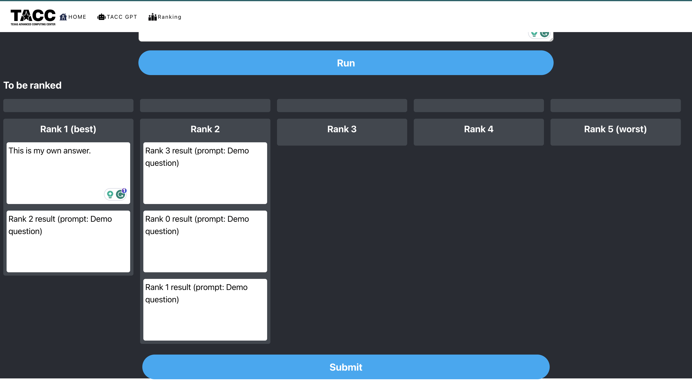

# TACC GPT
This repository contains the main code for setting up TACC GPT on your own machine.

## How to run
Before running the cmds below, please make sure you have docker installed and running in the background.

Also, to run TACC GPT, you need a LLM in (frontend_gradio)[./frontend_gradio]. It can be LLaMa2, Falcon, opt, or TACC GPT. Currently, we have fine-tuned opt1.3B with TACC tickets, and you can find it here
```
/work/09308/zhengmk/deepspeed_chat/DeepSpeedExamples/applications/DeepSpeed-Chat/training/step1_supervised_finetuning/output_1.3b_epoch32_sqLength512
```
After downloading it, put the complete folder under [./frontend_gradio/nlp_models](./frontend_gradio/nlp_models). Then, you should be able to do docker-compose like below:
```
docker-compose up --build -d
```
This process vary from few minutes to half an hour, depending onn your machine.

When you have it running, go to [localhost:3000](http://localhost:3000), and you should see the home page.



If you want to shut it down, use this cmd:
```
docker-compose down
```

## Structure
There are three main directories: backend, frontend, and frontend_gradio.
Each of them contains the code for the backend (fastapi), frontend (react), and [gradio](https://www.gradio.app/). If you are unsatisfied with the webui, you can always edit it by yourself :).

There are two main webpages: [TACC_GPT](http://0.0.0.0:9991/TACC_GPT) and [Ranking](http://localhost:3000/Ranking)





### TACC GPT page
In the TACC GPT page, you can ask any question. It can ticket related, such as 'How to install pytorch on frontera', or general question, such as 'Where is TACC'.

Please not that all the question-answer pairs will be recorded in the database, so please do not type any personal, sensitive questions.

### Ranking page
This page is for collecting the ranking results for training the reward model (please refer to the [InstructGPT paper](https://arxiv.org/pdf/2203.02155.pdf), if you want to know why it's needed). **For this purpose, please do use TACC GPT model.**

To use it, please follow the instructions below:
1. Type your question in the top text box.
   
2. Then, by cliking the `Run` button, you will receive 5 answers generated by the model. If you feel you typed something wrong, you can always, correct it and submit it again.
   
3. Now, it is time to use your expertise to rank those answers. To do so, simply drag and drop each one of the text boxes to the column named from "Rank 1 (best)" to "Rank 5 (worst)" below them. 
   
   Please note that you can always edit the answers, it you find none of them align with your own answer.
   
   Also, if you feel that some answers should have the same rank, just put them under the same column.
   
4. Submit the ranking result by clicking the `Submit` button. This button will only show up if all the generated answers are ranked. (Sometimes, JS has glitches. If you do finish ranking every answer, but still cannot see `Submit` button, just drag and drop any answer again, and it will show up).
5. After submitting the rankings, the page will refresh by itself.
   
   